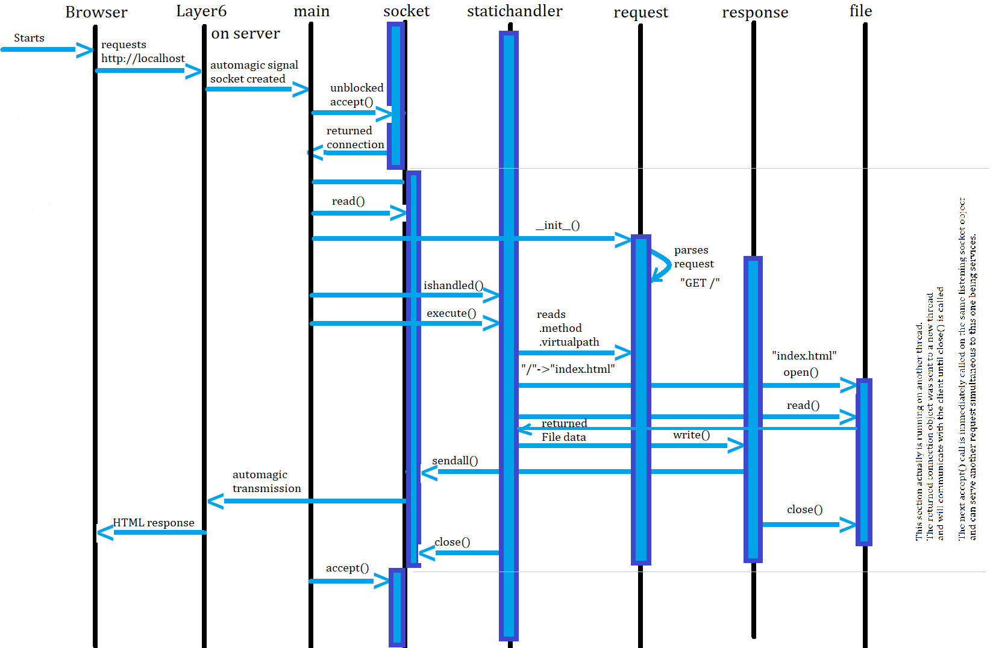
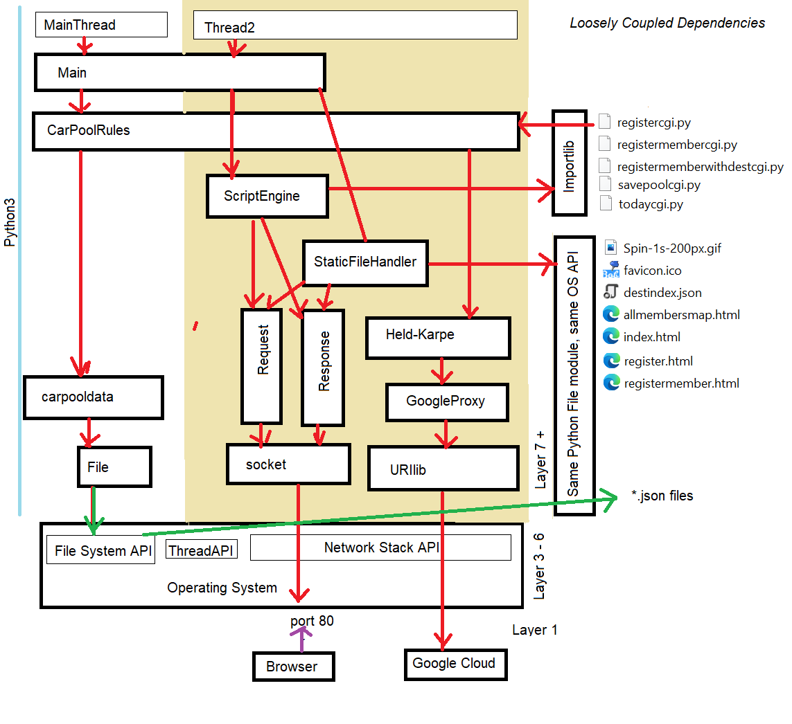
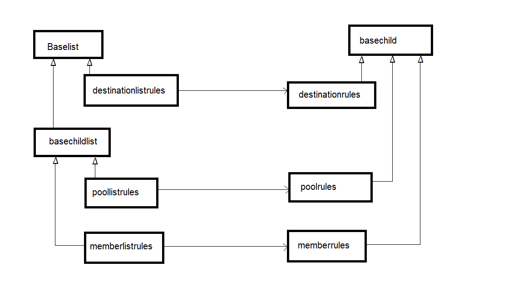
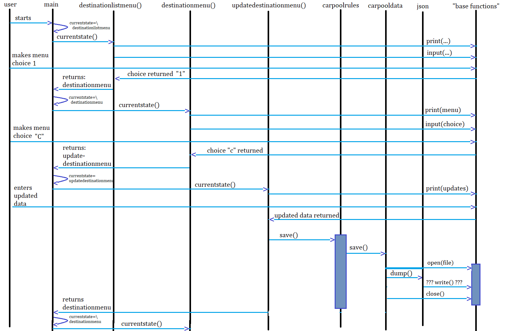

# CarPoolMashupPython
BCIT's CISA1360 Final Project in Python

Sequence diagram of custom HTTP Platform the Carpool app was built on:

Code relationship of the Carpool application:

Inheritance for the update rules, for saving and retreiving data:

Sequence of updating a destination record thru CLI:

